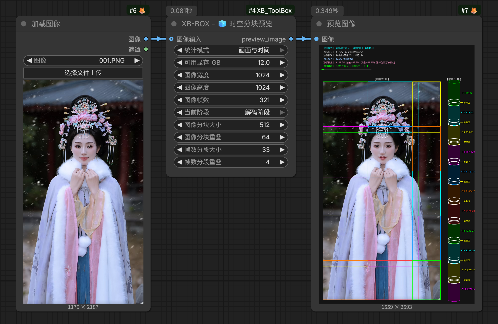
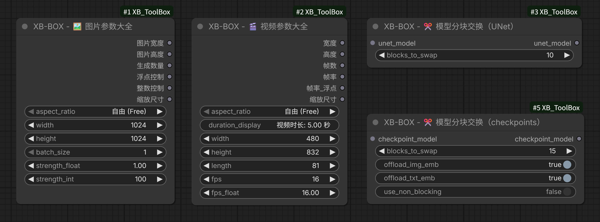
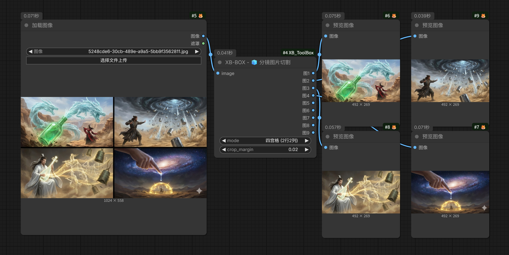
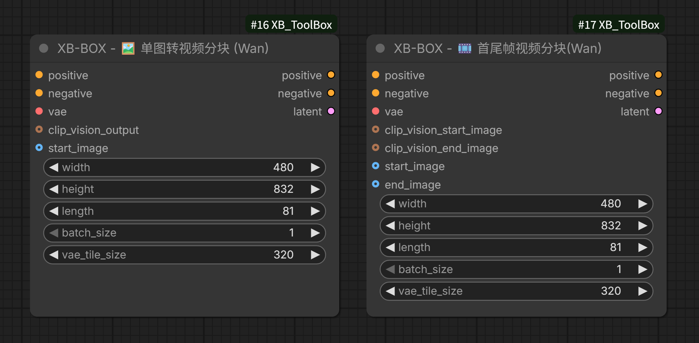
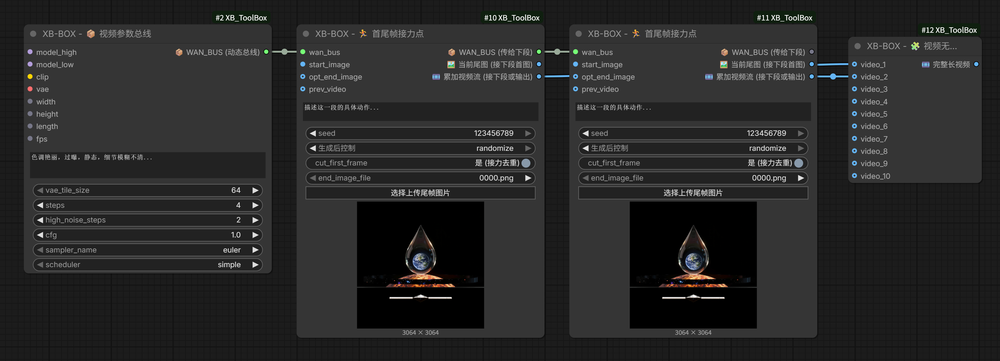
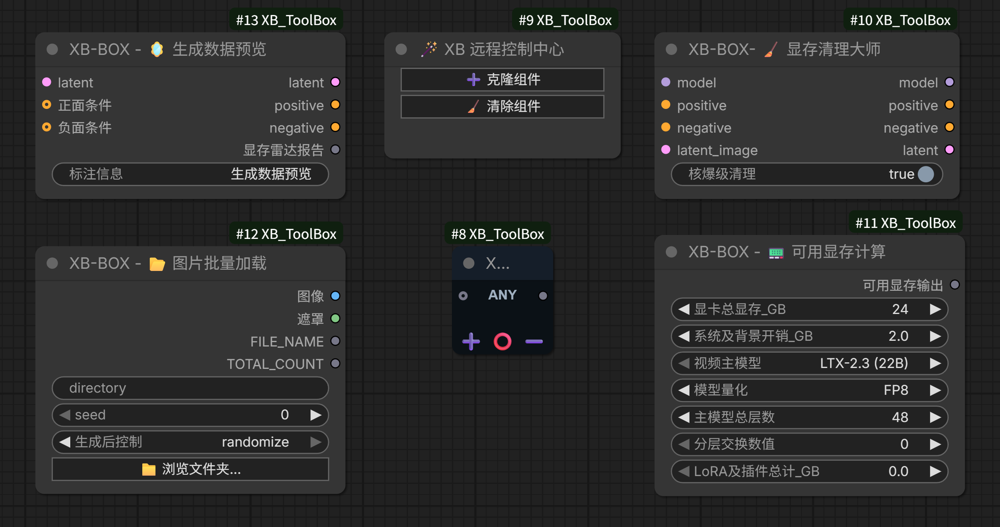

<div align="center">
  🌐 <a href="README.md">English</a> | <a href="README_zh.md">简体中文</a>
</div>
<br>

# 🧰 ComfyUI XB-BOX (XB_ToolBox)

---

## 🌟 Core Philosophy

The primary goal of **XB_ToolBox** is to help AI beginners new to ComfyUI quickly master workflows, making local deployment and execution simpler and more convenient. It is a comprehensive ComfyUI extension suite encompassing both front-end interaction and low-level memory scheduling.

- **Unified Parameters:** Integrates frequently used but scattered parameter nodes, allowing you to set essential image and video parameters from a single hub.
- **Visual Learning:** Provides visual chunking and parameter preview nodes, enabling beginners to intuitively understand the concepts of VAE/Encoder chunks, temporal slicing, and overlap effects.
- **UX Enhancements:** Introduces a user-friendly "Mirror Clone Console" (Dashboard) that clones major operation nodes from complex workflows into a unified, clean, and highly efficient control panel.
- **Extreme VRAM Optimization:** Through "Spatiotemporal Chunk Hijacking", "Dynamic VRAM Offloading for UNet/Checkpoints", and "Deep LiteGraph Customization", it allows consumer-grade GPUs to smoothly run massive 14B~22B 3D-DiT video models that would normally cause instant OOM (Out of Memory).

---










---

### ✨ Core Nodes

#### 1. 🎬 Media Parameters & Spatiotemporal Visualization

- **🖼️ Image Parameters Master**: Controls core image generation parameters (Width, Height, Batch Size, Strength) in one place. Enforces safe steps to prevent invalid inputs and automatically aligns dimensions when a fixed aspect ratio is selected.
- **🎬 Video Parameters Master**: Manages Width, Height, Frames, and FPS (Integer/Float). Features a geek-level "Auto-Manual Transmission Engine" that smoothly snaps to official pre-trained "Golden Buckets" (e.g., 480x832, 544x960) and strictly locks the physical frame count to the safe `1+8N` rule. Dynamically displays video duration based on frame rate.
- **🧊 Spatiotemporal Chunk Visualization**: An exclusive dual-zone radar! The 2D left panel visualizes spatial image chunks and overlap values, while the 3D right panel uses a painter's algorithm to render temporal cylinder stacks. Saves beginners from the exhaustion of blind parameter tuning.
- 🧊 **Storyboard Image Slicer:** Offers multiple modes to slice common 4-grid, 6-grid, 9-grid... images all at once and output multiple individual images. This makes image-to-video or start/end frame video generation much more convenient, and is highly effective for creating short dramas.
- **📟 VRAM Calculator & Data Radar**: Predicts VRAM footprint for WAN/LTX models under different quantizations (FP8/GGUF) and weighs tensor volumes with MB-level precision. Significantly reduces trial-and-error costs by helping users choose models fitting their VRAM capacity.

#### 2. 🧊 VRAM Optimization

- **🧊 Sampler Chunk Master**: Tailored for WAN/LTX. Performs spatiotemporal dual-axis slicing (Spatial Tiles & Temporal Chunks) in the Latent space. Hijacks model parameters in-place with an built-in `rocm_optimized` extreme memory reclamation strategy, breaking the large-tensor OOM curse.
- **✂️ Model Block Swap**: Supports both UNet and Checkpoint modes. Forcibly unloads the first N Transformer Blocks and Text/Image embedding layers to system RAM, trading time for space.
- **🧹 VRAM Cleaner**: Essential for pre-generation clearing. Delivers "nuclear-level cleanup" by deeply invoking `gc.collect()` and `torch.cuda.empty_cache()` to crush PyTorch cache fragmentation.

#### 3. 🎛️ Workflow Deployment Assistants

- **🪄 XB Dashboard Zen**: A "Mirror Clone Console" developed using low-level LiteGraph features. Batch-clones any scattered components in your workflow into a fixed panel. Features two-way data synchronization and direct arterial connections to create a clean, customized monitoring dashboard.
- **🎛️ Dynamic Bus**: An ultra-compact N-in/N-out `AnyType` universal bus node. Provides custom UI type labels and one-click channel addition/removal to save your workflow from "noodle wire" chaos.

---

### 📦 Installation

**Method 1: ComfyUI Manager (Recommended)**
Search for `XB_ToolBox` in the ComfyUI Manager and click install.

**Method 2: Manual Git Clone**
Navigate to your ComfyUI `custom_nodes` directory and run:

```bash
git clone https://github.com/wjluoxiao/XB_ToolBox.git
```

(Note: This extension relies purely on the native ComfyUI ecosystem through elegant Python/JS architecture. NO extra pip dependencies required! Plug and play.)

---

📝 License
This project is open-sourced under the Apache-2.0 License. It guarantees the freedom to share while protecting the patent defense rights of the core architecture code.

---